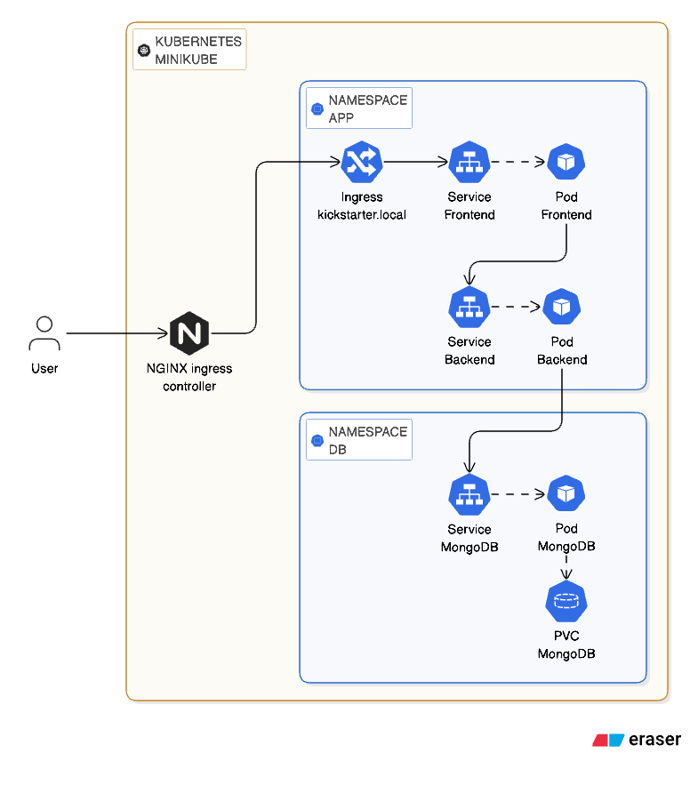
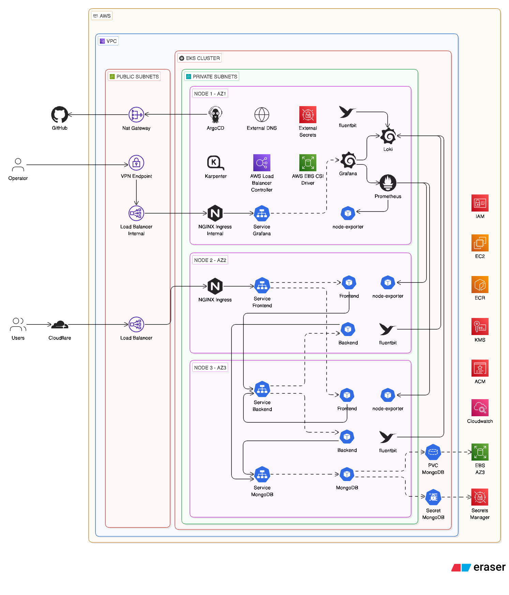

# Hackathon Starter Deployment Platform

This repository packages the Hackathon Starter application as two deployable services with a repeatable path from local setup to Kubernetes deployment.

The implementation is centered on portability:

- `services/hackathon-starter-frontend` serves the user-facing web app on port `3000`.
- `services/hackathon-starter-backend` exposes the companion service on port `8080`.
- MongoDB provides application persistence and session storage.
- `docker-compose.yml` provides a fast local container runtime.
- `terraform/` provisions the AWS network and EKS foundation used by the cloud deployment path.
- `k8s/helm` is a reusable Helm chart parameterized by per-service values files.
- `.github/workflows` builds, tests, pushes, and deploys each service independently to EKS.

## Architecture

### Diagrams:

Minikube deployment:



EKS CI/CD deployment:



### Approach

The main design choice was to keep the delivery path consistent across environments:

1. Package each app as its own container image.
2. Run both services against the same MongoDB dependency.
3. Use Docker Compose for local orchestration with minimal ceremony.
4. Use one generic Helm chart plus `values-backend.yaml` and `values-frontend.yaml` to avoid duplicating Kubernetes manifests.
5. Use separate GitHub Actions workflows so backend and frontend can be validated and released independently.

### Implementation summary

- `setup.sh` installs the required local tooling on macOS and Linux: Docker, Minikube, `kubectl`, Helm, and Terraform.
- `build.sh` logs into Docker Hub, builds both images from `services/`, tags them as `latest`, and pushes them.
- `deploy.sh` supports two targets:
  - `docker-compose`: starts MongoDB, backend, and frontend locally.
  - `minikube`: starts a cluster, enables ingress, installs MongoDB from Bitnami, and deploys both services through Helm.
- `cleanup.sh` tears down either the Compose stack or the Minikube cluster.
- `terraform/vpc` provisions the base AWS networking layer.
- `terraform/eks-karpenter` provisions the EKS cluster, bootstrap managed node group, and Karpenter IAM resources.
- `k8s/helm/templates` defines a generic Deployment, Service, and optional Ingress.
- `k8s/values-backend.yaml` and `k8s/values-frontend.yaml` inject image names, ports, and service-specific environment variables.
- `.github/workflows/deploy-backend.yml` and `.github/workflows/deploy-frontend.yml` run `npm ci`, lint, tests, container build/push, a Trivy scan, and `helm upgrade --install` against EKS.

## Repository layout

```text
.
├── config.yaml
├── docker-compose.yml
├── setup.sh
├── build.sh
├── deploy.sh
├── cleanup.sh
├── docs/diagrams/
├── terraform/
│   ├── vpc/
│   └── eks-karpenter/
├── k8s/
│   ├── helm/
│   ├── values-backend.yaml
│   └── values-frontend.yaml
├── services/
│   ├── hackathon-starter-backend/
│   └── hackathon-starter-frontend/
└── .github/workflows/
```

## Setup

### Prerequisites

- macOS or Linux
- Docker Desktop on macOS, or Docker Engine on Linux
- Node.js `24.13.0+` if you want to run the apps outside containers
- Access to Docker Hub for image publishing
- Access to an AWS account and an existing EKS cluster for the CI/CD deployment path
- Terraform `>= 1.5.7` if you want to provision the AWS infrastructure from this repository

Windows is not directly handled by the scripts. The practical option is WSL2 with Docker and Kubernetes tooling installed inside Linux.

### Automated workstation setup

The fastest path is:

```bash
./setup.sh
```

What it does:

- On macOS, it installs Docker Desktop through Homebrew and installs `minikube`, `kubectl`, `helm`, and `terraform`.
- On Linux, it installs Docker Engine, Minikube, `kubectl`, Helm, and the Terraform version declared in `config.yaml`.

Before running it:

- Ensure Homebrew exists on macOS.
- Ensure `sudo` access exists on Linux.
- Review `config.yaml` if you want a different Terraform or Kubernetes version.

### Environment-specific setup paths

#### 1. Run with Docker Compose

This is the simplest environment for validating the platform end to end.

```bash
docker compose up -d
```

Services:

- Frontend: `http://localhost:3000`
- Backend: `http://localhost:8080`
- MongoDB: `mongodb://localhost:27017/test`

The root `docker-compose.yml` uses prebuilt Docker Hub images by default:

- `vvi11iamng0/hackathon-starter-frontend`
- `vvi11iamng0/hackathon-starter-backend`

If you want to build from local source instead, uncomment the `build:` lines and replace or remove the `image:` lines.

#### 2. Run directly from source

Use this when you want to develop or debug one service locally without container indirection.

Backend:

```bash
cd services/hackathon-starter-backend
npm ci
npm start
```

Frontend:

```bash
cd services/hackathon-starter-frontend
npm ci
npm start
```

Requirements:

- A reachable MongoDB instance
- Real secrets provided through environment variables or by editing `.env.example`
- Non-placeholder OAuth/API credentials for any feature you intend to use

Notes:

- Both apps currently load configuration from `.env.example` in code. A standalone `.env` file is not read by default in this repository.
- For local runs, either export environment variables in your shell or replace the placeholders in `.env.example` with values appropriate to your machine.
- The frontend is intended to use `PORT=3000`.
- The backend is intended to use `PORT=8080`.

#### 3. Deploy to Minikube

```bash
./deploy.sh
```

Then select `minikube`.

The script will:

- start Minikube with the Kubernetes version from `config.yaml`
- enable the ingress addon
- add `kickstarter.local` to `/etc/hosts`
- create `db` and `app` namespaces
- install MongoDB through the Bitnami Helm chart
- deploy the backend and frontend through the shared chart

Expected access pattern:

- macOS: run `minikube service ingress-nginx-controller -n ingress-nginx --url` and then open `http://kickstarter.local:<port>`
- Linux: the script attempts to print the final ingress URL automatically

#### 4. Deploy through CI/CD to EKS

Pushes to `main` trigger per-service workflows when the changed files affect that service, the shared chart, or the corresponding values file.

The workflows deploy application releases into an existing EKS cluster. They do not provision AWS infrastructure themselves. That infrastructure can be created from the Terraform modules in `terraform/`.

Repository configuration required:

- GitHub secrets:
  - `DOCKERHUB_USERNAME`
  - `DOCKERHUB_TOKEN`
  - `AWS_ROLE_TO_ASSUME`
- GitHub variables:
  - `EKS_CLUSTER_NAME`
- Optional GitHub variables:
  - `AWS_REGION` default: `ap-southeast-1`
  - `K8S_NAMESPACE` default: `app`

Workflow behavior:

1. Check out code.
2. Install Node.js `24.x`.
3. Run `npm ci`.
4. Run lint and tests.
5. Build and push a Docker image tagged with both `${{ github.sha }}` and `latest`.
6. Run Trivy against the pushed image.
7. Assume the configured AWS role.
8. Update kubeconfig for EKS.
9. Run `helm upgrade --install` with the new image tag.

#### 5. Provision AWS infrastructure with Terraform

The repository contains two Terraform stacks:

- `terraform/vpc`: creates the shared VPC, public subnets, private subnets, and intra subnets in `ap-southeast-1`
- `terraform/eks-karpenter`: creates the EKS cluster, a bootstrap managed node group, and the Karpenter IAM resources

Current assumptions baked into the Terraform code:

- remote state is stored in S3 bucket `home-assignment-terraform-backend`
- the region is `ap-southeast-1`
- `terraform/eks-karpenter` reads VPC outputs from the `terraform/vpc` remote state
- the EKS Kubernetes version inside Terraform is currently set in the module itself and is separate from the Minikube `K8S_VERSION` in `config.yaml`

Typical apply sequence:

```bash
cd terraform/vpc
terraform init
terraform plan
terraform apply
```

```bash
cd terraform/eks-karpenter
terraform init
terraform plan
terraform apply
```

After cluster creation:

```bash
aws eks --region ap-southeast-1 update-kubeconfig --name ex-eks-karpenter
```

Notes:

- The EKS Terraform stack creates IAM resources for Karpenter, but it does not install the Karpenter Helm chart.
- The EKS Terraform stack also does not install the AWS Load Balancer Controller or the EBS CSI driver.
- Detailed cluster bootstrap instructions live in `terraform/eks-karpenter/README.md`.

## Configuration

Configuration exists at four layers: workstation bootstrap, Terraform infrastructure, container/runtime environment, and Kubernetes release settings.

### Root `config.yaml`

This file controls the helper scripts.

| Key | Used by | Effect |
| --- | --- | --- |
| `DOCKERHUB_USERNAME` | `build.sh` | Prefix for the published image names. |
| `DOCKERHUB_TOKEN` | `build.sh` | Enables non-interactive Docker Hub login. If empty, login becomes interactive. |
| `TERRAFORM_VERSION` | `setup.sh` | Version installed on Linux workstations. |
| `K8S_VERSION` | `deploy.sh` | Kubernetes version passed to `minikube start`. |

### Terraform configuration

Terraform-specific configuration currently lives in the module directories rather than in `config.yaml`.

Important behavior:

| Location | Effect |
| --- | --- |
| `terraform/vpc/versions.tf` | Pins Terraform/provider requirements and configures S3 remote state at key `vpc.tfstate`. |
| `terraform/vpc/main.tf` | Creates the base VPC in `ap-southeast-1`, including public, private, and intra subnets plus NAT. |
| `terraform/eks-karpenter/versions.tf` | Pins Terraform/provider requirements and configures S3 remote state at key `eks-karpenter.tfstate`. |
| `terraform/eks-karpenter/main.tf` | Creates the EKS control plane, bootstrap node group, and Karpenter IAM resources. |
| `terraform/eks-karpenter/main.tf` `kubernetes_version` | Controls the EKS cluster version for AWS. This is separate from local Minikube versioning. |
| `terraform/eks-karpenter/data.tf` | Reads the VPC outputs from remote state, so the VPC stack must exist first. |

### Runtime environment variables

The services also consume environment variables from their service directories. The full catalog is in:

- `services/hackathon-starter-backend/.env.example`
- `services/hackathon-starter-frontend/.env.example`

The most important settings are:

| Variable | Effect |
| --- | --- |
| `PORT` | Application listening port. Backend expects `8080`; frontend expects `3000`. |
| `BASE_URL` | Drives URL generation and whether cookies are marked `secure`; if it starts with `https`, the app trusts one proxy hop and sends secure cookies. |
| `BACKEND_URL` | Used by the frontend deployment to reach the backend service. |
| `MONGODB_URI` | MongoDB connection string for data and session persistence. |
| `SESSION_SECRET` | Signs session cookies. Weak or reused values reduce session integrity. |
| `RATE_LIMIT_GLOBAL` | Global request cap per 15-minute window. |
| `RATE_LIMIT_STRICT` | Stricter limit for sensitive flows such as forgot password and account verification. |
| `RATE_LIMIT_LOGIN` | Login throttling threshold; the 2FA limiter scales from this value. |
| `SMTP_USER`, `SMTP_PASSWORD`, `SMTP_HOST` | Required for mail-based flows such as contact or verification. |
| OAuth and API keys | Enable optional integrations such as GitHub, Google, Stripe, Twilio, OpenAI, Groq, and others in the upstream starter app. |

### Helm values

`k8s/helm/values.yaml` defines the generic schema. The service-specific overrides are:

- `k8s/values-backend.yaml`
- `k8s/values-frontend.yaml`

Important fields:

| Key | Effect |
| --- | --- |
| `fullnameOverride` | Stable release object names such as `backend` and `frontend`. |
| `replicaCount` | Number of pods created for that service. |
| `image.repository` | Container image to pull. |
| `image.tag` | Tag deployed by Helm. CI overrides this with the Git SHA. |
| `image.pullPolicy` | Pull behavior for the container runtime. |
| `service.port` | Cluster-facing service port. |
| `service.targetPort` | Container port exposed by the pod. |
| `env` | Literal environment variables injected into the container. |
| `ingress.enabled` | Enables or disables public routing for the service. |
| `ingress.className` | Ingress controller class, currently `nginx` for the frontend. |
| `ingress.hosts` | Hostname and path rules; frontend defaults to `kickstarter.local`. |
| `resources` | CPU and memory requests/limits when you want stricter scheduling and protection. |

## Build, test, and operations

### Build and publish images

```bash
./build.sh
```

This script expects `DOCKERHUB_USERNAME` and optionally `DOCKERHUB_TOKEN` from `config.yaml` or the shell environment.

### Tear down environments

```bash
./cleanup.sh
```

Then select either `docker-compose` or `minikube`.

### Service-level checks

Backend:

```bash
cd services/hackathon-starter-backend
npm run lint-check
npm test
```

Frontend:

```bash
cd services/hackathon-starter-frontend
npm run lint-check
npm test
```

## Troubleshooting

### `./setup.sh` fails on macOS

- Confirm Homebrew is installed and on `PATH`.
- If Docker is installed but not usable, open Docker Desktop once and wait for it to finish initialization.

### `./setup.sh` fails on Linux

- Confirm `sudo` is available.
- If `docker` was just installed, log out and back in so group membership changes take effect.

### Docker Compose starts but the app is unreachable

- Run `docker compose ps` and verify all three containers are healthy/running.
- Confirm ports `3000`, `8080`, and `27017` are not already in use.
- Check whether you are still using the remote `image:` values instead of building local changes.

### Node service exits with MongoDB connection errors

- Verify `MONGODB_URI` points to a reachable database.
- Confirm MongoDB is listening on the expected port.
- For direct local runs, ensure your exported variables or edited `.env.example` do not still point to the in-cluster hostname `mongodb.db`.

### Authentication behaves incorrectly behind HTTPS or ingress

- Review `BASE_URL`.
- The apps mark cookies as `secure` only when `BASE_URL` starts with `https`.
- The apps also set `trust proxy` differently based on that value, so a wrong URL can break login persistence or callback flows.

### Minikube deployment cannot be reached

- Check that `/etc/hosts` contains `kickstarter.local`.
- On macOS, remember the script does not print a final fixed URL; you must run `minikube service ingress-nginx-controller -n ingress-nginx --url`.
- Confirm the ingress addon is enabled with `minikube addons list`.

### `kubectl create namespace` fails during repeat Minikube deploys

The current `deploy.sh` uses `kubectl create namespace db` and `kubectl create namespace app` without ignoring existing namespaces. On a second run, that can stop the script early.

Practical recovery:

- delete the cluster with `./cleanup.sh`, then redeploy, or
- manually ensure the namespaces exist and rerun the later Helm commands yourself

### GitHub Actions build succeeds but deployment does not update EKS

- Verify `AWS_ROLE_TO_ASSUME` can access the target cluster.
- Confirm `EKS_CLUSTER_NAME` and `AWS_REGION` match the real cluster.
- Check that the Helm release names remain `backend` and `frontend`, because the workflows assume those names.

### Trivy reports critical vulnerabilities

- The workflows currently report CRITICAL findings but do not fail the job because `exit-code` is set to `0`.
- Treat that output as actionable anyway and update dependencies or base images before promoting to production.

## Security considerations

This repository has several useful controls, but it is still a starter platform and should not be treated as production-hardened by default.

### What is already in place

- Session data is stored in MongoDB instead of process memory.
- Rate limiting is enabled globally and on sensitive authentication routes.
- Secure cookies are enabled automatically when `BASE_URL` uses HTTPS.
- `x-powered-by` is disabled.
- CI runs linting, tests, image builds, and Trivy scanning before deployment.
- AWS access in GitHub Actions is designed around role assumption instead of static long-lived keys.

### Important gaps and risks

- The checked-in `.env.example` files contain placeholder and sample secrets from the upstream starter. Do not use them as real credentials.
- CSRF and some Lusca hardening middleware are currently commented out in both app entrypoints.
- Helm values inject environment variables as plain text. Sensitive values should move to Kubernetes Secrets or an external secret manager before production use.
- The Bitnami MongoDB install in `deploy.sh` disables auth for local Minikube convenience.
- The GitHub Actions Trivy step does not currently fail the pipeline on CRITICAL findings.
- No explicit resource requests/limits, network policies, secret rotation flow, or monitoring stack are defined in this repository.

### Recommended hardening before production use

1. Replace all sample credentials with real secrets stored outside git.
2. Re-enable and validate CSRF and related security middleware.
3. Move app secrets to AWS Secrets Manager, Kubernetes Secrets, or another managed secret store.
4. Enable MongoDB authentication and private network access.
5. Enforce HTTPS end to end and verify `BASE_URL` matches the public hostname.
6. Add resource requests/limits and health probes to the Helm chart.
7. Change Trivy to fail on CRITICAL issues.
8. Add observability: centralized logs, metrics, alerts, and deployment history.

## Notes

- The repository is optimized for demonstrable portability and automation rather than full production readiness.
- The two service directories remain close to the upstream Hackathon Starter layout, which makes the application feature-rich but also expands the configuration surface.
- For service-specific details, review each service's own README, `PROD_CHECKLIST.md`, and `SECURITY.md`.
